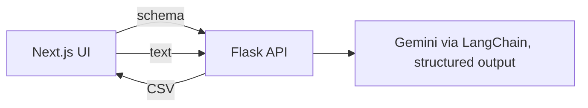

# AI Extraction

A web app that extracts structured data from unstructured text: you define a schema (field name, type, description), paste text, and a Google Gemini model returns a list of matching records you can export as CSV.

## How it works
1. Frontend sends field definitions to `POST /api/create-schema`; the backend generates a Pydantic model dynamically and binds it to the LLM with `with_structured_output`.
2. `POST /api/process-data` splits the text with `RecursiveCharacterTextSplitter` (configurable chunk size/overlap, defaults 1000/100), runs the model on each chunk and flattens the results.
3. `POST /api/export-csv` turns the result list into a downloadable CSV. `GET /health` reports status and model.



## Tech stack
- Backend: Flask, Flask-CORS, LangChain, `langchain-google-genai`, Pydantic, python-dotenv.
- Frontend: Next.js 15, React 19, Tailwind CSS, lucide-react, react-hot-toast.

## Structure
```
backend/app.py            # API (all logic)
backend/requirements.txt
backend/src, tests, notebooks, config   # template scaffolding (mostly empty)
frontend/src/app/page.js          # landing page
frontend/src/app/process/page.js  # extraction workflow UI
```

## Setup
Backend:
```bash
cd backend
pip install -r requirements.txt
# create backend/.env with GOOGLE_API_KEY and MODEL (Gemini model name)
python app.py        # frontend expects http://localhost:5000
```
Frontend:
```bash
cd frontend && npm install && npm run dev
```
API base URL is hard-coded to `http://localhost:5000` in the frontend.

## Limitations
- Schema is created with `exec()` on generated code and stored in module globals: shared across users and a code-injection risk if exposed publicly.
- No auth, no file upload (text paste only), tests are template placeholders; READMEs are the unmodified project template.
